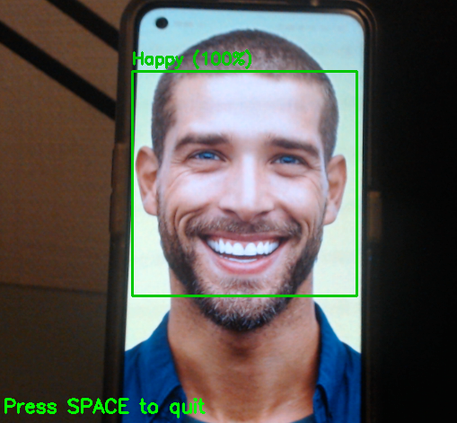

# Facial Expression Recognition with CNNs

  

## What this is

A CNN that classifies facial expressions in real-time from a webcam feed. Built with **PyTorch** on the **FER2013 dataset** (restricted to 5 emotion classes), reaching **73% accuracy**.

Built as a duo project.

> **Input:** 48×48 grayscale face crop → **Output:** predicted emotion + confidence scores for anger, happiness, sadness, surprise, neutral.

---

## Why 5 classes instead of 7?

FER2013 originally has 7 emotion labels, but "disgust" and "fear" are severely underrepresented and frequently mislabeled even by humans. Dropping them reduced label noise and let us focus on classes where the model could actually learn meaningful features a deliberate tradeoff between coverage and reliability.

---

## Architecture

Four convolutional blocks → flatten → three dense layers. Nothing exotic, but carefully regularized:

| Block | Filters | Structure | Dropout |
|:------|:--------|:----------|:--------|
| 1 | 64  | (Conv3×3 → BN → ReLU) ×2 + MaxPool | 0.25 |
| 2 | 128 | (Conv3×3 → BN → ReLU) ×2 + MaxPool | 0.25 |
| 3 | 256 | (Conv3×3 → BN → ReLU) ×2 + MaxPool | 0.35 |
| 4 | 512 | (Conv3×3 → BN → ReLU) ×2 + MaxPool | 0.40 |

The FC head takes the flattened 512×3×3 feature map through three dense layers with **0.5 dropout** between them. Final layer outputs raw logits (softmax at inference).

  <b>Model architecture</b> 
  

**Why this design:** We started with 2 blocks and scaled up empirically. The increasing dropout per block (0.25 → 0.40) was our main weapon against overfitting on such a small, noisy dataset — uniform dropout across blocks gave worse val accuracy.

---

## Training details

- **Loss:** Cross-Entropy
- **Optimizer:** Adam with weight decay
- **Augmentation:** random horizontal flips + small rotations — kept conservative since aggressive augmentation on 48×48 images destroyed too much facial structure
- **Normalization:** dataset-level mean/std (not ImageNet stats, since we're working with grayscale faces)

---

## Results

**73% test accuracy** on our 5-class subset.

Per-class breakdown (what we observed):
- **Happy** and **Surprise** are the easiest — distinct facial features (smile, open mouth)
- **Sad** vs **Neutral** is the hardest boundary — subtle differences at 48×48
- **Angry** is often confused with **Sad** due to similar brow patterns

For context, published results on the full 7-class FER2013 top out around 75% even with much deeper architectures. On a 5-class subset with a relatively shallow CNN, 73% is a solid baseline.

---

## Real-time demo

The most fun part of this project. We built a pipeline that runs the model live on webcam input:

1. **Face detection** with OpenCV Haar cascades on each frame
2. **Crop + preprocess** the detected face ROI (same normalization as training)
3. **Inference** through the CNN
4. **Overlay** predicted emotion + probability bars directly on the video feed

It runs smoothly on CPU. Main failure cases: extreme head poses, poor lighting, and partial occlusions — all expected given the training data distribution.

---

## Honest limitations

- **FER2013 is a rough dataset.** 48×48 grayscale with inconsistent labeling. The accuracy ceiling is real.
- **No attention mechanism.** The model treats the whole face equally — adding spatial attention to focus on discriminative regions (eyes, mouth) would likely help.
- **Haar cascades are outdated** for face detection. MTCNN or RetinaFace would give better crops, especially on edge cases.
- **We didn't try transfer learning.** Fine-tuning a pretrained backbone (even something small like MobileNet) would probably beat our CNN with less training time.

These aren't just "future work" bullet points they're the things we'd actually do if we continued the project.

---

## Try it yourself

Click the badge to open the notebook in Colab. The first cell downloads the dataset and pretrained weights from Google Drive automatically.

**Quick run (skip training):** only run cells 1-2-3-6-7-9-14-15.

---

## References

1. Zhang, K. et al. (2016). *Joint Face Detection and Alignment using Multi-task Cascaded Convolutional Networks*. [arXiv:1604.02878](https://arxiv.org/abs/1604.02878)
2. [FER2013 dataset on Kaggle](https://www.kaggle.com/datasets/msambare/fer2013)
3. Białek, C., Matiolański, A. & Grega, M. (2023). *An Efficient Approach to Face Emotion Recognition with Convolutional Neural Networks*. [Electronics, 12(12)](https://www.mdpi.com/2079-9292/12/12/2707)
